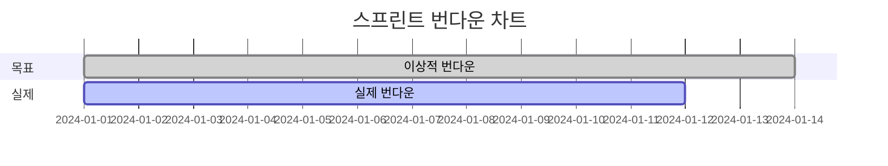

# 활동 대시보드

실시간 팀 활동 모니터링과 프로젝트 인사이트를 제공하는 종합 대시보드입니다.

## 📊 메인 대시보드

### 실시간 활동 피드
```markdown
최근 활동 (실시간):
🔄 jane.doe가 PR #245를 생성했습니다 (2분 전)
✅ john.smith가 이슈 #1023을 완료했습니다 (15분 전)
🔍 AI가 보안 취약점을 발견했습니다 (30분 전)
📝 alice.kim이 새 이슈 #1025를 생성했습니다 (45분 전)
```

### 핵심 지표 (KPI)
```yaml
이번_주_성과:
  완료된_이슈: 47개 (+12% vs 지난주)
  병합된_PR: 23개 (+8% vs 지난주)
  평균_리뷰_시간: 4.2시간 (-0.8시간 개선)
  버그_발견율: 0.8% (-0.3% 개선)
```

## 🎯 프로젝트별 현황

### 프로젝트 상태 카드
```markdown
📦 웹 애플리케이션 v2.1
├── 진행률: ██████████░░ 83%
├── 활성 이슈: 12개
├── 대기 중인 PR: 3개
└── 다음 마일스톤: 2024-02-15

🔧 모바일 앱 리팩토링  
├── 진행률: ███████░░░░░ 65%
├── 활성 이슈: 8개
├── 대기 중인 PR: 1개
└── 다음 마일스톤: 2024-02-28
```

### 팀 성과 비교
```yaml
팀별_생산성:
  Frontend팀:
    완료율: 94%
    평균_사이클_타임: 3.2일
    
  Backend팀:
    완료율: 89%
    평균_사이클_타임: 4.1일
    
  DevOps팀:
    완료율: 96%
    평균_사이클_타임: 2.8일
```

## 📈 분석 차트

### 번다운 차트


### 코드 품질 트렌드
- **복잡도**: 평균 7.2 (양호)
- **테스트 커버리지**: 84% (+2% 이번 주)
- **중복 코드**: 3.1% (-0.5% 이번 주)
- **기술 부채**: 중간 수준

## 👥 팀원 활동 분석

### 개인별 기여도
```yaml
이번_주_TOP_기여자:
  1위_john_smith:
    커밋: 23개
    PR: 5개
    리뷰: 12개
    
  2위_jane_doe:
    커밋: 19개
    PR: 4개
    리뷰: 15개
    
  3위_alice_kim:
    커밋: 16개
    PR: 3개
    리뷰: 8개
```

### 작업 분포
- **개발**: 65%
- **리뷰**: 20%
- **테스팅**: 10%
- **문서화**: 5%

## 🚨 알림 및 경고

### 주의 필요 항목
```markdown
⚠️ 긴급 사항:
- 프로덕션 빌드 실패 (30분 전)
- 보안 취약점 발견 (2시간 전)

📋 요주의 항목:
- PR #240이 3일째 리뷰 대기중
- 이슈 #1020이 마감일 임박 (1일 남음)
- 테스트 커버리지가 80% 아래로 하락
```

### AI 인사이트
```yaml
AI_추천사항:
  생산성_향상:
    - "코드 리뷰 시간을 단축하기 위해 자동 리뷰 규칙 추가 권장"
    - "반복적인 버그 패턴 발견, 린터 규칙 강화 필요"
    
  리스크_관리:
    - "john.smith의 작업 부하가 평균보다 40% 높음"
    - "Backend팀의 버그 발견율이 증가 추세"
```

## 📱 모바일 대시보드

### 간소화된 뷰
- 핵심 KPI만 표시
- 푸시 알림 지원
- 오프라인 모드 지원
- 터치 친화적 인터페이스

### 빠른 액션
```markdown
원터치 액션:
🔄 PR 승인/거부
✅ 이슈 상태 변경  
📝 빠른 댓글 작성
👀 알림 확인
```

## 🔍 상세 분석 도구

### 필터링 옵션
- **날짜 범위**: 일/주/월/분기
- **팀별**: Frontend, Backend, DevOps
- **프로젝트별**: 활성 프로젝트 선택
- **타입별**: 이슈, PR, 커밋, 리뷰

### 내보내기 기능
```yaml
리포트_생성:
  형식: [PDF, Excel, CSV]
  주기: [수동, 일간, 주간, 월간]
  수신자: [관리자, 팀장, 이해관계자]
```

## ⚙️ 대시보드 커스터마이징

### 위젯 설정
- **드래그 앤 드롭**으로 레이아웃 변경
- **크기 조절** 가능한 차트
- **색상 테마** 선택
- **알림 설정** 개인화

### 저장된 뷰
```markdown
사용자 정의 뷰:
📊 "관리자 뷰" - KPI 중심
👨‍💻 "개발자 뷰" - 코드 품질 중심  
📈 "PM 뷰" - 진행률 중심
🔍 "QA 뷰" - 품질 지표 중심
```

---

**유용한 팁**: 대시보드를 정기적으로 확인하여 팀의 생산성과 프로젝트 건강도를 모니터링하세요. 📊 