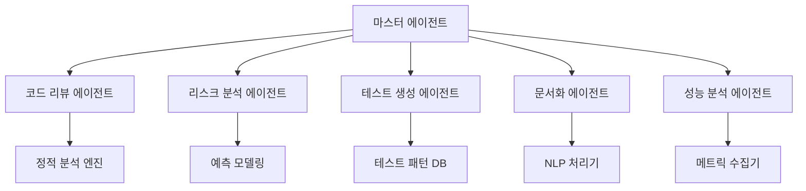

# 시스템 구조 개요

CollabOps의 AI 에이전트 시스템은 다양한 전문 에이전트들이 협력하여 개발 프로세스를 지능적으로 지원합니다.

## 🤖 AI 에이전트 아키텍처



## 🎯 전문 에이전트들

### 코드 리뷰 에이전트
- **역할**: 코드 품질, 보안, 성능 분석
- **모델**: GPT-4 Turbo + Custom Fine-tuned
- **처리량**: 1,000+ 파일/분

### 리스크 분석 에이전트  
- **역할**: 프로젝트 위험 요소 예측
- **모델**: Time Series + Random Forest
- **정확도**: 87% 위험 예측 정확도

### 테스트 생성 에이전트
- **역할**: 자동 테스트 케이스 생성
- **모델**: CodeT5 + Custom Training
- **커버리지**: 평균 15% 향상

## 🧠 AI 모델 스택

### 언어 모델
```yaml
코드_분석:
  primary: "GPT-4 Turbo"
  fallback: "Claude-3 Sonnet"
  
자연어_처리:
  primary: "GPT-3.5 Turbo"
  specialized: "BERT-based Custom"
  
코드_생성:
  primary: "CodeLlama-34B"
  backup: "StarCoder"
```

### 특화 모델
- **버그 예측**: XGBoost + Feature Engineering
- **성능 분석**: LSTM + Attention
- **보안 스캔**: Rule-based + ML Hybrid

## 📊 성능 지표

### 응답 시간
- 코드 리뷰: 평균 2-5초
- 리스크 분석: 평균 1-3초  
- 테스트 생성: 평균 10-30초

### 정확도
- 버그 감지: 92%
- 보안 취약점: 95%
- 성능 이슈: 88%

## 🔧 커스터마이징

### 팀별 학습
```python
# 팀 특화 모델 훈련
team_model = AIAgent.create_custom_model(
    team_id="frontend-team",
    training_data=team_code_history,
    focus_areas=["react", "typescript", "accessibility"]
)
```

### 규칙 설정
```yaml
custom_rules:
  code_quality:
    max_function_length: 50
    max_complexity: 8
    enforce_typescript: true
    
  security:
    require_input_validation: true
    block_dangerous_functions: true
```

---

**다음 단계**: [에이전트 역할 정의](/ai-agents/agent-roles) 