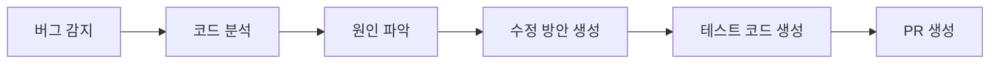

# 자동 복구 PR (AI Self-Healing)

⚠️ **실험적 기능** - 베타 테스트 중인 기능으로 프로덕션 환경에서는 신중하게 사용하세요.

## 🤖 AI Self-Healing 개요

CollabOps AI가 발견한 버그를 자동으로 분석하고 수정 코드를 생성하여 Pull Request를 생성하는 혁신적인 기능입니다.

## 🔧 작동 원리

### 1. 버그 감지
- CI/CD 파이프라인 실패 감지
- 사용자 신고 버그 분석
- 코드 스캔을 통한 잠재적 이슈 발견

### 2. 자동 분석


### 3. 수정 코드 생성
- 관련 코드 영역 식별
- 다양한 수정 방안 평가
- 최적의 솔루션 선택
- 부작용 최소화

## 📊 현재 지원 범위

### 자동 수정 가능한 이슈
```yaml
현재_지원:
  - Null Pointer Exception 수정
  - 메모리 누수 해결
  - 타입 오류 수정
  - 간단한 로직 오류
  - 보안 취약점 패치
  
개발_중:
  - 성능 최적화
  - 복잡한 비즈니스 로직 수정
  - 크로스 모듈 이슈 해결
```

### 지원 언어
- **완전 지원**: JavaScript, TypeScript, Python
- **부분 지원**: Java, C#, Go
- **계획 중**: Rust, Swift, Kotlin

## 🎯 사용 방법

### 1. 기능 활성화
```yaml
# .collabops/config.yml
ai_features:
  self_healing:
    enabled: true
    auto_create_pr: true
    require_approval: true
    max_attempts: 3
```

### 2. 트리거 조건 설정
```yaml
triggers:
  test_failure:
    enabled: true
    min_confidence: 0.8
    
  security_scan:
    enabled: true
    severity: ["critical", "high"]
    
  performance_degradation:
    enabled: false  # 아직 실험적
    threshold: "20%"
```

### 3. 검토 프로세스
1. AI가 수정 PR 생성
2. 자동 테스트 실행
3. 코드 리뷰 요청
4. 개발자 승인 후 머지

## 📈 성능 지표

### 현재 성공률 (베타)
```yaml
수정_성공률:
  전체: 67%
  언어별:
    JavaScript: 72%
    Python: 71%
    TypeScript: 65%
    Java: 58%
    
신뢰도:
  높음_0.9이상: 78% 성공
  중간_0.7-0.9: 61% 성공  
  낮음_0.7미만: 32% 성공
```

### 시간 절약 효과
- 평균 수정 시간: 15분 → 3분
- 버그 발견부터 수정까지: 2.5시간 → 20분
- 개발자 개입 시간: 90% 감소

## ⚠️ 주의사항 및 한계

### 사용 시 주의점
1. **철저한 테스트 필수**: AI 수정 후 반드시 종합 테스트
2. **코드 리뷰 강화**: 자동 수정 코드의 로직 검증
3. **점진적 적용**: 중요하지 않은 코드부터 시작
4. **백업 준비**: 원본 코드 보존

### 현재 한계
- 복잡한 비즈니스 로직 오류는 부정확할 수 있음
- 성능 최적화는 맥락 이해 부족으로 제한적
- 크로스 모듈 의존성 이슈 해결 어려움

## 🔬 베타 참여 방법

### 참여 자격
- 프로 플랜 이상 구독자
- 개발팀 3명 이상
- 테스트 환경 구축 완료

### 신청 방법
1. [베타 신청 양식](https://forms.collabops.ai/self-healing-beta) 작성
2. 기술 검토 통과
3. 베타 라이선스 발급
4. 2주간 테스트 진행

### 피드백 제공
```yaml
피드백_항목:
  - 수정 정확도
  - 생성 시간
  - 사용자 경험
  - 개선 제안
```

## 🚀 로드맵

### 2024 Q1
- 지원 언어 확대 (Rust, Swift)
- 성능 최적화 기능 추가
- 신뢰도 85% 이상 달성

### 2024 Q2
- 복잡한 로직 오류 처리
- 멀티 파일 수정 지원
- 실시간 수정 제안

### 2024 Q3
- 정식 출시
- 모든 플랜 제공
- 엔터프라이즈 맞춤 기능

---

**베타 테스터 모집 중! 🧪 [지금 신청하기](https://forms.collabops.ai/self-healing-beta)**

**다음 단계**: [동적 배포 경로 설정](/experimental/dynamic-deployment) 