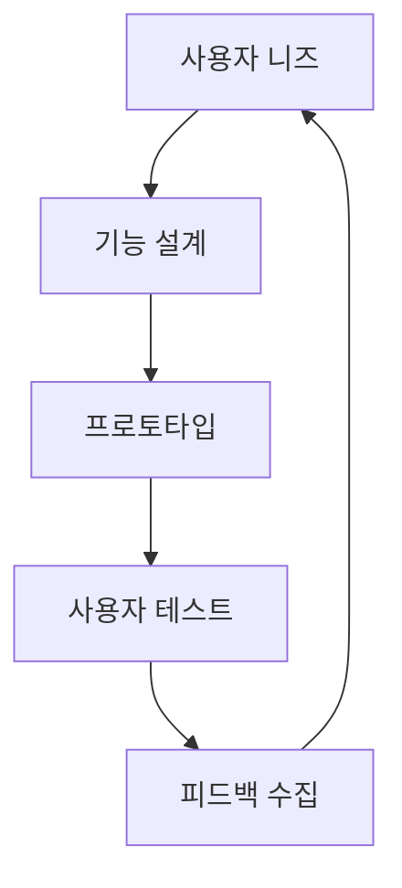

# 비전 및 철학

## 🎯 우리의 비전

> **"모든 개발팀이 창의성에 집중할 수 있는 세상을 만든다"**

CollabOps는 반복적이고 번거로운 업무를 자동화하여, 개발자들이 진정 중요한 창의적 작업에 집중할 수 있는 환경을 제공합니다.

## 💡 핵심 철학

### 1. 투명성 (Transparency)
모든 작업 과정이 투명하게 공개되어, 팀원 누구나 프로젝트의 현재 상태를 명확히 파악할 수 있어야 합니다.

**구현 방식:**
- 실시간 대시보드를 통한 프로젝트 현황 공개
- 모든 의사결정 과정의 기록 및 추적
- 역할별 맞춤형 정보 제공으로 투명성과 효율성 균형

### 2. 자동화 (Automation)
인간이 해야 할 일과 기계가 해야 할 일을 명확히 구분하여, 반복 작업은 완전히 자동화합니다.

**자동화 영역:**
- 코드 품질 검사 및 보안 스캔
- 테스트 실행 및 배포 프로세스
- 이슈 분류 및 우선순위 설정
- 문서화 및 리포팅

### 3. 인텔리전스 (Intelligence)
단순한 도구를 넘어서, 데이터 기반의 인사이트를 제공하여 더 나은 의사결정을 돕습니다.

**AI 활용 분야:**
- 코드 리뷰 시 패턴 분석 및 개선 제안
- 프로젝트 리스크 예측 및 조기 경고
- 팀 성과 분석 및 최적화 권장사항
- 개인화된 학습 콘텐츠 추천

### 4. 개방성 (Openness)
오픈 표준과 API를 통해 기존 도구들과 완벽하게 연동되며, 벤더 락인을 방지합니다.

**개방성 원칙:**
- 표준 API 제공으로 타 도구와의 연동성 보장
- 오픈소스 컴포넌트 적극 활용
- 데이터 포팅 기능으로 마이그레이션 자유도 제공

## 🌍 사회적 임팩트

### 개발자 경험 개선
- **번아웃 방지**: 반복 업무 자동화로 스트레스 감소
- **학습 촉진**: AI 어시스턴트를 통한 지속적인 성장 지원
- **창의성 증진**: 핵심 업무에 집중할 수 있는 환경 제공

### 팀 협업 혁신
- **의사소통 효율화**: 컨텍스트 기반 스마트 알림
- **지식 공유**: 자동화된 문서화 및 베스트 프랙티스 전파
- **품질 향상**: AI 기반 코드 리뷰로 일관된 품질 유지

### 비즈니스 가치 창출
- **출시 시간 단축**: 자동화된 CI/CD 파이프라인
- **운영 비용 절감**: 효율적인 리소스 관리
- **리스크 최소화**: 사전 예측을 통한 문제 방지

## 🏗️ 설계 원칙

### 사용자 중심 설계

### 점진적 개선
- **MVP 우선**: 핵심 기능부터 완성도 높게 구현
- **지속적 개선**: 사용자 피드백 기반 반복 개선
- **실험 문화**: A/B 테스트를 통한 데이터 기반 의사결정

### 확장 가능성
- **모듈형 아키텍처**: 필요에 따라 기능 추가/제거 가능
- **마이크로서비스**: 독립적인 서비스 단위로 확장
- **플러그인 시스템**: 서드파티 개발자들의 기여 환경 제공

## 🚀 미래 비전

### 2025년: AI 네이티브 플랫폼
- 모든 워크플로우에 AI 어시스턴트 통합
- 자연어 기반 프로젝트 관리
- 예측적 이슈 관리 및 자동 해결

### 2026년: 글로벌 개발 생태계
- 다국가, 다시간대 팀을 위한 최적화
- 실시간 언어 번역 및 문화적 컨텍스트 고려
- 글로벌 개발자 커뮤니티 플랫폼

### 장기 비전: 자율적 개발 환경
- 요구사항부터 배포까지 완전 자동화
- 인간은 창의적 설계와 전략적 의사결정에 집중
- AI와 인간의 완벽한 협업 환경

## 🤝 커뮤니티와 함께하는 여정

CollabOps는 혼자만의 플랫폼이 아닙니다. 전 세계 개발자들과 함께 만들어가는 플랫폼입니다.

### 오픈소스 기여
- **핵심 컴포넌트 오픈소스화**: 투명성과 신뢰성 확보
- **커뮤니티 기여 프로그램**: 개발자들의 참여 활성화
- **기술 공유**: 컨퍼런스, 블로그를 통한 지식 공유

### 교육과 성장
- **무료 교육 프로그램**: 개발팀의 협업 역량 강화
- **멘토링 플랫폼**: 시니어와 주니어 개발자 연결
- **베스트 프랙티스 공유**: 성공 사례 및 노하우 전파

---

**다음 단계**: [대상 사용자 알아보기](/intro/target-users) 