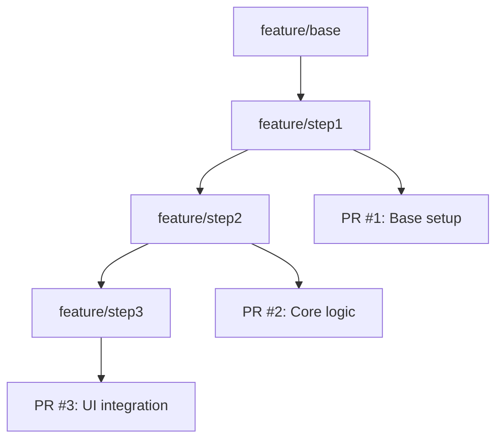

# Pull Request 관리

체계적인 Pull Request 프로세스로 코드 품질을 향상시키고 팀 협업을 강화할 수 있습니다.

## 📝 Pull Request 생성

### 기본 PR 생성 프로세스
1. **브랜치 푸시 후 자동 PR 제안**
2. **PR 정보 입력**:
   ```markdown
   # PR 제목 (명확하고 구체적으로)
   feat: 사용자 프로필 이미지 업로드 기능 추가
   
   ## 📋 변경 사항
   - 이미지 업로드 UI 컴포넌트 구현
   - 파일 크기 및 형식 검증 로직 추가
   - S3 연동을 통한 이미지 저장 구현
   
   ## 🔗 관련 이슈
   Closes #123
   Related to #124, #125
   
   ## 🧪 테스트 방법
   1. 프로필 페이지 접속
   2. 이미지 업로드 버튼 클릭
   3. 다양한 형식의 파일 업로드 테스트
   4. 결과 확인
   
   ## 📷 스크린샷 (해당하는 경우)
   
   ```

### PR 템플릿 활용
```markdown
<!-- .collabops/pull_request_template.md -->
## 🎯 작업 내용
간단한 작업 내용 요약

## 📋 변경 사항
- [ ] 새로운 기능
- [ ] 버그 수정  
- [ ] 리팩토링
- [ ] 문서 업데이트
- [ ] 테스트 추가

## 🔗 관련 이슈
Closes #이슈번호

## 🧪 테스트
- [ ] 유닛 테스트 추가/수정
- [ ] 통합 테스트 확인
- [ ] 수동 테스트 완료

## 📝 체크리스트
- [ ] 코드 스타일 가이드 준수
- [ ] 테스트 케이스 추가
- [ ] 문서 업데이트
- [ ] 브레이킹 체인지 확인

## 🔍 리뷰 포인트
리뷰어가 특별히 확인해야 할 부분
```

## 👥 코드 리뷰 프로세스

### 리뷰 요청 및 할당
```yaml
자동_리뷰어_할당:
  파일_기반:
    "frontend/**": ["@frontend-team"]
    "backend/**": ["@backend-team"]
    "docs/**": ["@tech-writer"]
  
  라벨_기반:
    "security": ["@security-team"]
    "performance": ["@performance-team"]
    "api": ["@api-team"]
  
  규칙:
    최소_리뷰어: 1
    최대_리뷰어: 3
    필수_승인: 1
```

### 효과적인 코드 리뷰
```markdown
✅ 좋은 리뷰 댓글:
- "이 함수의 시간 복잡도를 O(n)으로 개선할 수 있을 것 같습니다. Map을 사용해보시겠어요?"
- "보안상 사용자 입력값 검증이 필요해 보입니다. Joi나 Yup 같은 라이브러리 고려해보세요."
- "훌륭한 구현입니다! 다만 에러 핸들링 부분을 추가하면 더 견고할 것 같네요."

❌ 피해야 할 리뷰 댓글:
- "이상하네요" (구체적이지 않음)
- "다시 해보세요" (대안 제시 없음)  
- "틀렸습니다" (건설적이지 않음)
```

### 리뷰 상태 관리
- **💬 Comment**: 의견이나 질문
- **✅ Approve**: 승인 (머지 가능)
- **❌ Request Changes**: 수정 요청 (머지 차단)
- **👀 Review**: 검토 완료 (의견 없음)

## 🔄 PR 워크플로우 자동화

### 자동 검증 단계
```yaml
pr_checks:
  필수_검사:
    - "CI/CD Pipeline": 빌드 및 테스트
    - "Code Quality": SonarQube 품질 게이트
    - "Security Scan": 보안 취약점 검사
    - "License Check": 라이선스 호환성
  
  조건부_검사:
    - "Performance Test": 성능 관련 변경 시
    - "E2E Test": UI 변경 시
    - "Migration Test": DB 스키마 변경 시
    
  추가_검사:
    - "Accessibility": 접근성 검사
    - "Bundle Size": 번들 크기 체크
    - "Breaking Changes": API 변경 감지
```

### 자동 라벨링
```javascript
// PR 자동 라벨링 규칙
const autoLabelPR = (pr) => {
  const labels = [];
  
  // 파일 변경 기반
  if (pr.changedFiles.some(f => f.includes('test'))) {
    labels.push('test');
  }
  
  // 크기 기반
  if (pr.additions + pr.deletions > 500) {
    labels.push('large');
  }
  
  // 타입 기반 (제목에서 추출)
  const typeMatch = pr.title.match(/^(feat|fix|docs|style|refactor|test|chore):/);
  if (typeMatch) {
    labels.push(`type: ${typeMatch[1]}`);
  }
  
  return labels;
};
```

## 📊 PR 분석 및 메트릭

### PR 성능 지표
```yaml
리뷰_메트릭:
  평균_리뷰_시간: "2.5시간"
  첫_번째_리뷰까지: "30분"
  최종_승인까지: "4시간"
  
크기_분석:
  소형_PR: "< 100 라인 (70%)"
  중형_PR: "100-300 라인 (25%)"
  대형_PR: "> 300 라인 (5%)"
  
품질_지표:
  승인률: "95%"
  재작업률: "15%"
  핫픽스_비율: "3%"
```

### PR 대시보드
```markdown
📈 이번 주 PR 현황:
- 생성: 23개
- 머지: 18개  
- 대기 중: 5개
- 평균 머지 시간: 6시간

🏆 팀 기여도:
- Alice: 8 PR (리뷰 12회)
- Bob: 6 PR (리뷰 15회)
- Charlie: 4 PR (리뷰 8회)

⚠️ 주의 필요:
- 3일 이상 대기: 2개 PR
- 대형 PR (500+ 라인): 1개
- 리뷰어 부족: 1개 PR
```

## 🔀 머지 전략

### 머지 방식 선택
```yaml
Merge_Commit:
  사용_시기: "기능 브랜치의 히스토리 보존 필요"
  장점: "완전한 히스토리, 롤백 용이"
  단점: "복잡한 히스토리"

Squash_and_Merge:  
  사용_시기: "깔끔한 히스토리 선호"
  장점: "선형 히스토리, 간단함"
  단점: "중간 커밋 정보 손실"

Rebase_and_Merge:
  사용_시기: "선형 히스토리 + 커밋 보존"
  장점: "깔끔하면서도 상세한 히스토리"
  단점: "충돌 해결 복잡"
```

### 자동 머지 조건
```yaml
auto_merge_rules:
  조건:
    - all_checks_passed: true
    - required_reviews_met: true
    - no_merge_conflicts: true
    - author_can_merge: true
  
  예외:
    - draft_pr: false
    - has_label: "do-not-merge"
    - target_branch: "main"  # main은 수동 머지만
```

## 🚀 고급 PR 기능

### PR 체인 관리


### 충돌 해결 자동화
```bash
# 자동 충돌 해결 도구
git config merge.tool collabops-merge
git config mergetool.collabops-merge.cmd 'collabops-resolver $LOCAL $REMOTE $MERGED'

# 사용법
git checkout feature-branch
git rebase main
# 충돌 발생 시 자동으로 CollabOps 충돌 해결 도구 실행
```

### Draft PR 활용
```markdown
Draft PR 사용 시나리오:
- 🔄 진행 중인 작업 공유
- 💬 초기 피드백 수집
- 🧪 실험적 구현 검토
- 📋 작업 계획 검토

Draft에서 Ready로 전환 시:
- 자동으로 리뷰어 할당
- CI/CD 파이프라인 실행
- 품질 검사 수행
```

## 🎯 PR 최적화 전략

### 작은 PR 권장
```yaml
PR_크기_가이드라인:
  이상적: "< 200 라인"
  수용_가능: "200-400 라인"  
  분할_권장: "> 400 라인"
  
분할_전략:
  - 기능별 분할
  - 레이어별 분할 (UI, Logic, Data)
  - 단계별 분할 (Setup, Implementation, Integration)
```

### 리뷰 효율성 향상
```markdown
리뷰어를 위한 도움말:
1. 📋 체크리스트 제공
2. 🎯 핵심 변경사항 하이라이트  
3. 📷 시각적 자료 첨부
4. 🔍 테스트 시나리오 명시
5. ❓ 구체적인 질문 포함

예시:
"특히 `UserService.validateInput()` 메서드의 보안 검증 로직을 
중점적으로 검토해주세요. SQL 인젝션 방어가 충분한지 확인 부탁드립니다."
```

## 📋 PR 품질 체크리스트

### 작성자 체크리스트
- [ ] 명확하고 구체적인 제목
- [ ] 상세한 설명과 컨텍스트
- [ ] 관련 이슈 링크
- [ ] 테스트 방법 명시
- [ ] 브레이킹 체인지 여부 표시
- [ ] 스크린샷/GIF (UI 변경 시)

### 리뷰어 체크리스트  
- [ ] 요구사항 충족 여부
- [ ] 코드 품질 및 스타일
- [ ] 성능 영향도
- [ ] 보안 취약점
- [ ] 테스트 커버리지
- [ ] 문서 업데이트 필요성

---

**다음 단계**: [커밋 히스토리 보기](/usage/git-engine/commit-history) 