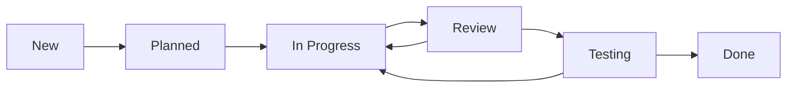

# 이슈 생성 및 관리

이슈 트래커는 CollabOps의 핵심 기능으로, 버그 리포트부터 기능 요청까지 모든 작업을 체계적으로 관리할 수 있습니다.

## 📝 이슈 생성하기

### 기본 이슈 생성
1. **Issues** 탭 클릭
2. **"New Issue"** 버튼 클릭
3. 이슈 정보 입력:
   - **제목**: 명확하고 구체적인 제목
   - **설명**: 문제 상황 또는 요구사항 상세 기술
   - **타입**: Bug, Feature, Enhancement, Task 중 선택
   - **우선순위**: Critical, High, Medium, Low
   - **담당자**: 팀원 지정
   - **라벨**: 관련 태그 추가

### 이슈 템플릿 활용
CollabOps는 일관된 이슈 생성을 위한 템플릿을 제공합니다:

#### 버그 리포트 템플릿
```markdown
## 🐛 버그 설명
버그에 대한 명확하고 간결한 설명

## 🔄 재현 단계
1. '...'로 이동
2. '....'를 클릭
3. '....'까지 스크롤
4. 오류 발생 확인

## ✅ 예상 동작
정상적으로 발생해야 하는 동작 설명

## ❌ 실제 동작
실제로 발생한 동작 설명

## 📷 스크린샷
해당하는 경우 스크린샷 첨부

## 🖥️ 환경 정보
- OS: [예: iOS]
- 브라우저: [예: Chrome, Safari]
- 버전: [예: 22]

## 📋 추가 정보
다른 관련 정보나 컨텍스트
```

#### 기능 요청 템플릿
```markdown
## 🚀 기능 제안
새로운 기능에 대한 명확한 설명

## 💭 동기 및 배경
이 기능이 필요한 이유와 해결하고자 하는 문제

## 📝 상세 설명
기능의 구체적인 동작 방식

## 🔄 대안 검토
고려해본 다른 해결책들

## 📋 추가 컨텍스트
관련 스크린샷, 참고 자료 등
```

#### 작업 (Task) 템플릿
```markdown
## ⚡ 작업 개요
수행해야 할 작업에 대한 간략한 설명

## 🎯 목표
이 작업을 통해 달성하고자 하는 목표

## 📋 체크리스트
- [ ] 세부 작업 1
- [ ] 세부 작업 2
- [ ] 세부 작업 3

## 📚 참고 자료
관련 문서, 링크 등

## ✅ 완료 조건
작업이 완료되었다고 판단할 수 있는 기준
```

## 🏷️ 라벨 및 분류 시스템

### 기본 라벨 시스템
- **타입**: `bug`, `feature`, `enhancement`, `documentation`, `task`
- **우선순위**: `priority:critical`, `priority:high`, `priority:medium`, `priority:low`
- **상태**: `status:new`, `status:in-progress`, `status:review`, `status:done`
- **컴포넌트**: `frontend`, `backend`, `api`, `database`, `mobile`
- **난이도**: `difficulty:easy`, `difficulty:medium`, `difficulty:hard`

### 컬러 코딩 시스템
```css
/* 타입별 색상 */
bug: #d73a49        /* 빨간색 */
feature: #0366d6    /* 파란색 */
enhancement: #28a745 /* 초록색 */
documentation: #6f42c1 /* 보라색 */

/* 우선순위별 색상 */
critical: #b60205   /* 진한 빨간색 */
high: #d93f0b      /* 주황색 */
medium: #fbca04    /* 노란색 */
low: #0e8a16       /* 연한 초록색 */
```

### 커스텀 라벨 생성
1. **Settings** → **Labels** → **Create Label**
2. 라벨 정보 입력:
   ```
   Name: "security"
   Color: "#ff6b6b"
   Description: "보안 관련 이슈"
   ```
3. **Create Label** 클릭

## 👥 이슈 할당 및 협업

### 담당자 지정 전략
- **단일 담당자**: 주 책임자 1명 지정 (명확한 책임 소재)
- **참여자**: 관련된 팀원들 추가 (협업 필요 시)
- **감시자**: 진행 상황을 확인해야 하는 팀원 (PM, 리더 등)

### 효과적인 댓글 작성
```markdown
# 멘션 활용
@username 님, 이 부분에 대해 확인해주세요.

# 코드 블록으로 관련 코드 공유
```python
def example_function():
    return "Hello World"
```

# 체크리스트 활용
진행 상황:
- [x] 요구사항 분석 완료
- [x] 설계 문서 작성
- [ ] 구현 진행 중
- [ ] 테스트 대기 중

# 이미지 첨부

```

### 이슈 업데이트 베스트 프랙티스
1. **정기적 업데이트**: 최소 주 2회 진행 상황 공유
2. **구체적 정보**: "진행 중"보다 "API 연동 80% 완료" 등 구체적 표현
3. **블로커 즉시 공유**: 막힌 부분이 있으면 즉시 도움 요청
4. **관련 자료 첨부**: 스크린샷, 로그, 코드 스니펫 등

## 🔗 이슈 연결 및 관계 설정

### Git 커밋과 연결
커밋 메시지에서 이슈 참조:
```bash
git commit -m "fix: 로그인 버그 수정

사용자가 잘못된 비밀번호 입력 시 적절한 에러 메시지 표시

Fixes #123
- 패스워드 검증 로직 수정
- 에러 메시지 개선
- 테스트 케이스 추가"
```

### Pull Request와 연결
PR 설명에서 이슈 참조:
```markdown
## 변경 사항
로그인 버그 수정 및 사용자 경험 개선

## 관련 이슈
Closes #123
Related to #124, #125

## 테스트 방법
1. 잘못된 비밀번호로 로그인 시도
2. 적절한 에러 메시지 확인
3. 올바른 비밀번호로 로그인 성공 확인
```

### 이슈 간 관계 설정
- **Blocks**: 이 이슈가 다른 이슈를 막고 있음
- **Blocked by**: 다른 이슈에 의해 막혀있음
- **Related to**: 관련된 이슈
- **Duplicate of**: 중복 이슈
- **Child of**: 하위 이슈 (Epic의 구성 요소)

```markdown
# 관계 설정 예시
이 이슈는 다음과 관련됩니다:
- Blocks: #126 (이 기능이 완성되어야 다음 작업 가능)
- Related: #124, #125 (유사한 성격의 작업들)
- Child of: #120 (로그인 개선 Epic의 일부)
```

## 📊 이슈 관리 및 분석

### 고급 필터링
```
# 복합 조건 검색
assignee:@me label:bug priority:high is:open

# 날짜 기반 검색
created:2024-01-01..2024-01-31 is:closed

# 텍스트 검색
"로그인 오류" in:title,body

# 담당자별 검색
assignee:john OR assignee:jane

# 라벨 조합
label:frontend label:bug -label:duplicate
```

### 칸반 보드 뷰
```
[📝 백로그]    [🔧 진행중]    [👀 리뷰]    [✅ 완료]
  Issue #1      Issue #5      Issue #8     Issue #12
  Issue #2      Issue #6      Issue #9     Issue #13
  Issue #3      Issue #7      Issue #10    Issue #14
  Issue #4                    Issue #11
```

**보드 설정:**
- **백로그**: `status:new`, `status:planned`
- **진행중**: `status:in-progress`
- **리뷰**: `status:review`, `status:testing`
- **완료**: `status:done`, `status:closed`

### 이슈 통계 대시보드
- **완료율**: 전체 이슈 대비 완료된 이슈 비율
- **평균 해결 시간**: 이슈 생성부터 해결까지 소요 시간
- **담당자별 작업량**: 팀원별 할당된 이슈 수와 완료율
- **라벨별 분포**: 이슈 타입별 분포 현황
- **우선순위 분석**: 긴급 이슈 처리 현황

## 🔄 이슈 워크플로우 최적화

### 표준 워크플로우


### 팀별 맞춤 워크플로우

#### 개발팀 워크플로우
```
New → Analyzed → In Progress → Code Review → QA Testing → Done
```

#### 디자인팀 워크플로우
```
New → Research → Designing → Review → Revision → Approved
```

#### 마케팅팀 워크플로우
```
New → Planning → Creating → Review → Scheduled → Published
```

## 🚀 이슈 관리 자동화

### 자동 라벨링
```yaml
# .github/labeler.yml
"frontend":
  - "src/components/**/*"
  - "src/pages/**/*"

"backend":
  - "api/**/*"
  - "server/**/*"

"documentation":
  - "docs/**/*"
  - "README.md"
```

### 자동 할당
```yaml
# 코드 변경 시 자동 할당
/.github/: @devops-team
/frontend/: @frontend-team
/backend/: @backend-team
/docs/: @tech-writer
```

### 자동 상태 업데이트
```yaml
# PR 머지 시 관련 이슈 자동 닫기
on:
  pull_request:
    types: [closed]
    
if: github.event.pull_request.merged == true
# 커밋 메시지의 "Closes #123" 파싱하여 자동 닫기
```

## 📈 이슈 품질 향상 팁

### 좋은 이슈 제목 작성법
```markdown
❌ 나쁜 예:
- "버그"
- "로그인 안됨"
- "개선 필요"

✅ 좋은 예:
- "fix: Safari에서 로그인 버튼 클릭 시 응답 없음"
- "feat: 사용자 프로필 이미지 업로드 기능 추가"
- "docs: API 인증 방법 문서 업데이트"
```

### 효과적인 이슈 설명 구조
1. **문제 상황 요약** (한 줄)
2. **상세 설명** (배경 정보)
3. **재현 방법** (버그의 경우)
4. **예상 결과**
5. **실제 결과**
6. **환경 정보**
7. **추가 자료** (스크린샷, 로그 등)

### 우선순위 설정 가이드라인
- **Critical**: 서비스 중단, 보안 취약점
- **High**: 주요 기능 오류, 사용자 경험 심각한 저하
- **Medium**: 일반적인 버그, 개선 사항
- **Low**: 마이너한 UI 이슈, 향후 고려 사항

---

**다음 단계**: [상태 및 워크플로우 설정](/usage/issue-tracker/status-workflow) 