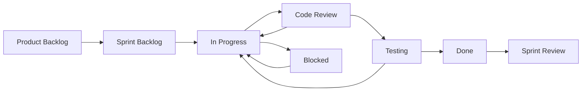
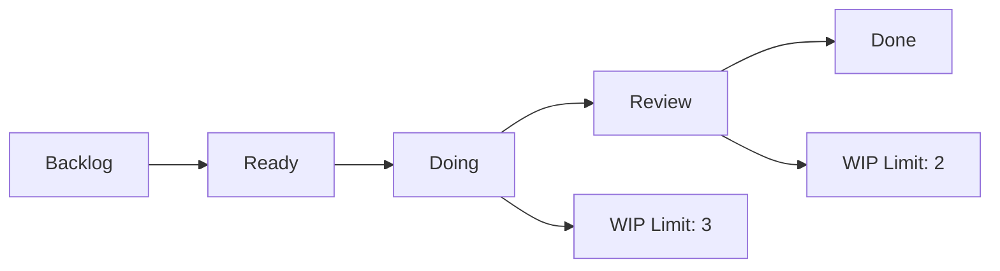
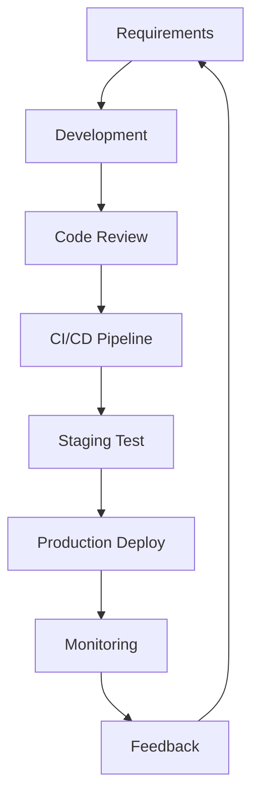
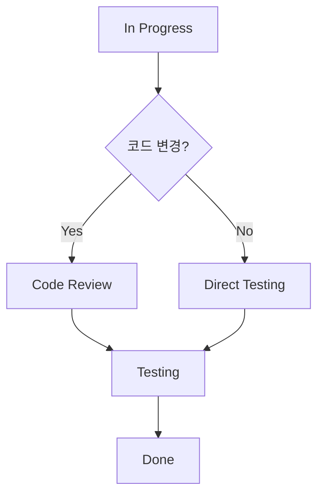
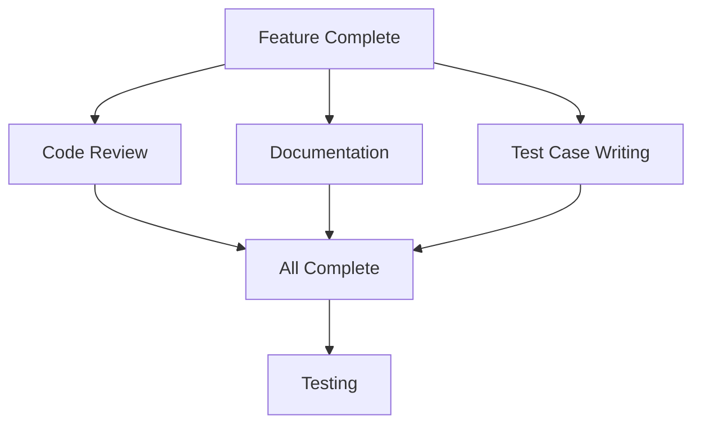

# 상태 및 워크플로우

팀의 작업 방식에 맞는 이슈 상태와 워크플로우를 설정하여 효율적인 프로젝트 관리를 실현할 수 있습니다.

## 🔄 기본 이슈 상태

### 표준 상태 시스템
- **🆕 New**: 새로 생성된 이슈, 아직 검토 전
- **📋 Planned**: 계획되어 백로그에 포함된 이슈
- **🔧 In Progress**: 현재 작업 중인 이슈
- **👀 Review**: 코드 리뷰 또는 검토 대기 중
- **🧪 Testing**: QA 테스트 진행 중
- **✅ Done**: 완료된 이슈
- **❌ Cancelled**: 취소된 이슈
- **⏸️ On Hold**: 일시 중단된 이슈

### 상태별 의미와 조건

#### New → Planned
**전환 조건:**
- 이슈 내용 검토 완료
- 우선순위 설정
- 대략적인 일정 수립
- 담당자 지정 (선택사항)

**자동화 규칙:**
```yaml
triggers:
  - 라벨 추가 시 자동 전환
  - 마일스톤 할당 시
  - 스프린트 계획 회의 후
```

#### Planned → In Progress
**전환 조건:**
- 담당자 확정
- 작업 시작 선언
- 관련 브랜치 생성

**자동화 규칙:**
```yaml
triggers:
  - Git 브랜치 생성 시 (issue-123-login-fix)
  - 담당자가 이슈에 댓글 작성 시
  - 첫 번째 커밋 푸시 시
```

#### In Progress → Review
**전환 조건:**
- 구현 작업 완료
- Pull Request 생성
- 코드 리뷰 요청

**자동화 규칙:**
```yaml
triggers:
  - PR 생성 시 자동 전환
  - "Ready for review" 라벨 추가 시
```

#### Review → Testing
**전환 조건:**
- 코드 리뷰 승인
- PR 머지 완료
- 테스트 환경 배포

**자동화 규칙:**
```yaml
triggers:
  - PR 머지 시 자동 전환
  - QA 라벨 추가 시
```

#### Testing → Done
**전환 조건:**
- QA 테스트 통과
- 프로덕션 배포 완료
- 검증 완료

**자동화 규칙:**
```yaml
triggers:
  - 모든 테스트 케이스 통과 시
  - 프로덕션 배포 성공 시
```

## ⚙️ 워크플로우 커스터마이징

### 개발 방법론별 워크플로우

#### 애자일/스크럼 워크플로우


**특징:**
- 스프린트 기반 계획
- 데일리 스탠드업 반영
- 스프린트 리뷰/회고 포함

#### 칸반 워크플로우


**특징:**
- 지속적인 흐름
- WIP (Work In Progress) 제한
- 병목 지점 시각화

#### DevOps 워크플로우


**특징:**
- CI/CD 통합
- 자동화된 테스트
- 지속적인 모니터링

### 팀 규모별 워크플로우

#### 소규모 팀 (1-5명)
```yaml
워크플로우: 간소화
상태: [To Do, Doing, Done]
리뷰: 페어 프로그래밍 또는 간단한 체크
배포: 수동 또는 간단한 자동화
```

#### 중간 규모 팀 (6-20명)
```yaml
워크플로우: 표준
상태: [Backlog, Ready, In Progress, Review, Testing, Done]
리뷰: 코드 리뷰 필수
배포: CI/CD 파이프라인
```

#### 대규모 팀 (21명+)
```yaml
워크플로우: 엄격한 프로세스
상태: [Epic, Story, Task, In Progress, Review, QA, UAT, Done]
리뷰: 다단계 리뷰 프로세스
배포: 단계별 배포 (Dev → Staging → Prod)
```

## 🎯 상태 전환 규칙 설정

### 전환 권한 관리
```yaml
상태_전환_권한:
  New → Planned:
    - PM
    - Tech Lead
    - Admin
  
  Planned → In Progress:
    - Assignee
    - PM
    - Admin
  
  In Progress → Review:
    - Assignee
    - Admin
  
  Review → Testing:
    - Reviewer
    - PM
    - Admin
  
  Testing → Done:
    - QA Engineer
    - PM
    - Admin
```

### 필수 조건 설정
```yaml
상태_전환_조건:
  → In Progress:
    required:
      - assignee_set
      - priority_defined
    optional:
      - milestone_assigned
  
  → Review:
    required:
      - pull_request_created
      - tests_passing
    optional:
      - documentation_updated
  
  → Done:
    required:
      - all_tests_passed
      - peer_review_approved
      - qa_sign_off
```

### 자동 전환 규칙
```javascript
// 자동 상태 전환 예시
const autoTransitionRules = {
  // PR 생성 시 Review 상태로 전환
  onPullRequestCreate: (issue) => {
    if (issue.status === 'In Progress') {
      issue.updateStatus('Review');
    }
  },
  
  // 모든 리뷰 승인 시 Testing으로 전환
  onAllReviewsApproved: (issue) => {
    if (issue.status === 'Review') {
      issue.updateStatus('Testing');
    }
  },
  
  // 3일 이상 비활성 시 On Hold로 전환
  onInactivityTimeout: (issue) => {
    if (issue.daysSinceLastUpdate > 3) {
      issue.updateStatus('On Hold');
      issue.addComment('3일 이상 비활성으로 인해 자동으로 On Hold 상태로 전환되었습니다.');
    }
  }
};
```

## 📊 워크플로우 메트릭스

### 흐름 효율성 측정
```yaml
리드_타임: 이슈 생성부터 완료까지 총 시간
사이클_타임: 작업 시작부터 완료까지 시간
대기_시간: 각 상태에서 머무르는 시간
처리량: 단위 시간당 완료되는 이슈 수
```

### 병목 지점 분석
```markdown
상태별 평균 체류 시간:
- New: 1.2일 ✅
- Planned: 0.5일 ✅  
- In Progress: 3.8일 ✅
- Review: 2.1일 ⚠️ (병목 의심)
- Testing: 1.5일 ✅
- Done: - ✅

권장 조치:
- Review 단계 병목 해결
- 리뷰어 추가 배정
- 리뷰 시간 단축 방안 검토
```

### 품질 지표
```yaml
결함_누출률: Review를 통과했지만 Testing에서 발견되는 이슈 비율
재작업률: Done에서 다시 이전 상태로 돌아가는 이슈 비율
완료_예측_정확도: 예상 완료일 대비 실제 완료일 정확도
```

## 🔧 고급 워크플로우 기능

### 조건부 분기


### 병렬 처리


### 승인 프로세스
```yaml
승인_단계:
  - level: "Technical Review"
    approvers: ["tech-lead", "senior-dev"]
    required_count: 1
  
  - level: "Security Review"
    approvers: ["security-team"]
    required_count: 1
    conditions:
      - has_label: "security"
  
  - level: "Business Approval"
    approvers: ["product-manager"]
    required_count: 1
    conditions:
      - priority: "high"
      - has_label: "feature"
```

## 🚀 워크플로우 최적화 방법

### 지속적 개선
1. **주간 메트릭스 리뷰**: 워크플로우 성능 지표 분석
2. **월간 회고**: 팀과 함께 워크플로우 개선점 논의
3. **분기별 조정**: 팀 성장과 프로젝트 변화에 맞는 워크플로우 업데이트

### A/B 테스트
```yaml
실험_설정:
  그룹A: 기존 5단계 워크플로우
  그룹B: 간소화된 3단계 워크플로우
  측정_지표:
    - 완료 시간
    - 팀 만족도
    - 품질 지표
  실험_기간: 4주
```

### 팀 피드백 수집
```markdown
월간 워크플로우 서베이:
1. 현재 워크플로우가 작업에 도움이 되나요? (1-5점)
2. 가장 번거로운 단계는 무엇인가요?
3. 추가했으면 하는 기능이나 단계가 있나요?
4. 자동화했으면 하는 부분이 있나요?
5. 전반적인 만족도는? (1-5점)
```

## 🎨 워크플로우 시각화

### 상태 보드 커스터마이징
```css
/* 상태별 커스텀 스타일 */
.status-new { 
  background-color: #f3f4f6; 
  border-left: 4px solid #6b7280; 
}

.status-in-progress { 
  background-color: #dbeafe; 
  border-left: 4px solid #3b82f6; 
}

.status-review { 
  background-color: #fef3c7; 
  border-left: 4px solid #f59e0b; 
}

.status-done { 
  background-color: #d1fae5; 
  border-left: 4px solid #10b981; 
}
```

### 진행률 시각화
```
프로젝트 진행률:
████████░░ 80%

단계별 현황:
New        ████░░░░░░ 40% (4/10)
In Progress ██████░░░░ 60% (3/5)
Review     ████████░░ 80% (4/5)
Testing    ██████████ 100% (2/2)
Done       ██████████ 100% (15/15)
```

---

**다음 단계**: [라벨 및 태그 설정](/usage/issue-tracker/labels-tags) 