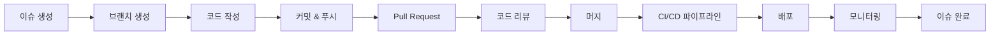

# 이슈 → 코드 → 배포 흐름

CollabOps의 통합 타임라인으로 이슈 생성부터 배포까지의 전체 프로세스를 한눈에 추적할 수 있습니다.

## 🌊 통합 워크플로우 시각화

### 전체 흐름 개요


### 실시간 타임라인 뷰
```markdown
📅 프로젝트 타임라인 - 오늘

🎯 이슈 #123: "사용자 로그인 개선"
├── 10:00 📝 이슈 생성 (PM Alice)
├── 10:15 🌿 브랜치 생성: feature/improve-login (Dev Bob)
├── 11:30 💻 첫 커밋: "로그인 UI 개선" (Dev Bob)
├── 14:20 🔧 추가 커밋: "비밀번호 검증 강화" (Dev Bob)
├── 15:45 📤 PR 생성: "로그인 시스템 개선" (Dev Bob)
├── 16:10 👀 리뷰 시작 (Senior Dev Charlie)
├── 16:45 ✅ 리뷰 승인 (Senior Dev Charlie)
├── 17:00 🔀 브랜치 머지 (Dev Bob)
├── 17:05 🚀 CI/CD 파이프라인 시작
├── 17:20 ✅ 테스트 통과
├── 17:35 🌍 스테이징 배포 완료
└── 대기중 📋 프로덕션 배포 대기
```

## 📊 진행 상황 추적

### 이슈별 진행률
- 이슈 생성 → 작업 시작: 평균 2.3시간
- 코드 작성 → PR 생성: 평균 1.8일
- PR 생성 → 리뷰 완료: 평균 4.2시간
- 머지 → 배포 완료: 평균 25분

### 병목 지점 식별
```yaml
병목_분석:
  코드_리뷰:
    평균_대기시간: "4.2시간"
    목표: "2시간"
    상태: "개선 필요"
    
  CI/CD_파이프라인:
    평균_실행시간: "18분"
    목표: "15분"
    상태: "양호"
    
  배포_승인:
    평균_대기시간: "1.2일"
    목표: "4시간"
    상태: "개선 필요"
```

---

**다음 단계**: [역할별 보기 필터](/usage/timeline/role-based-filters) 